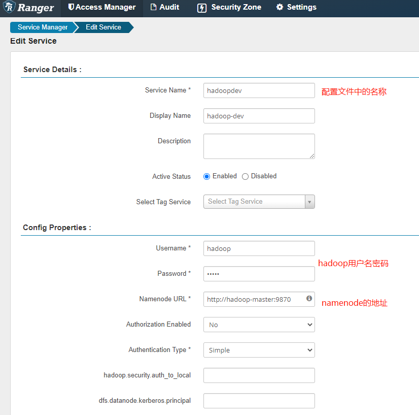
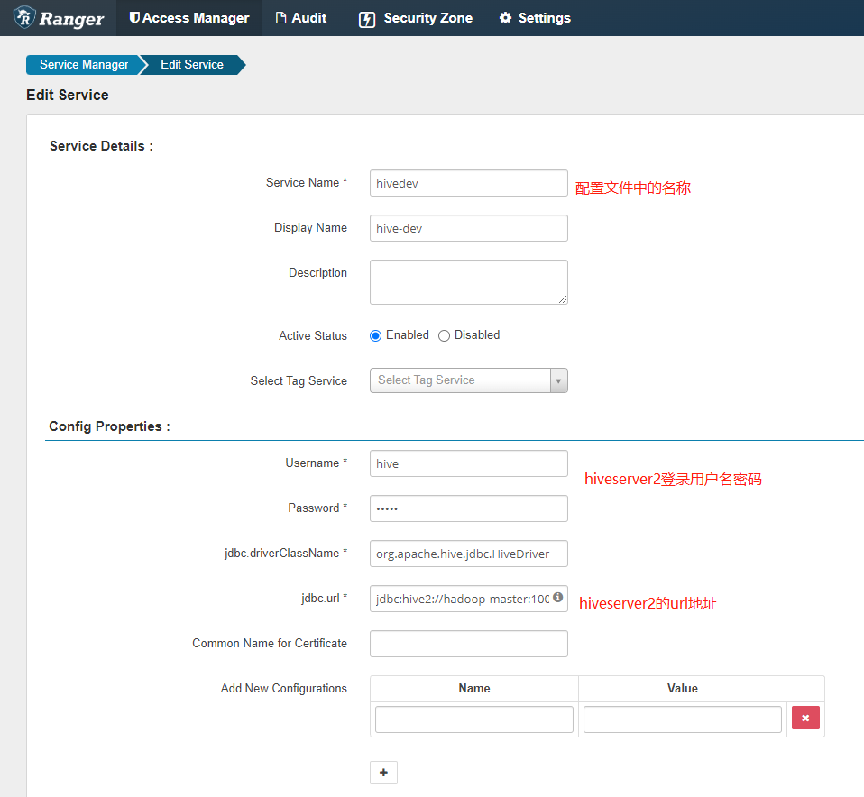
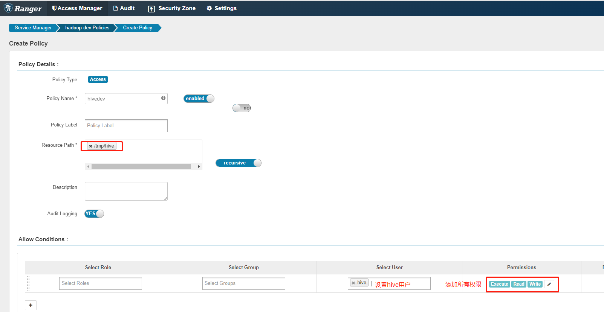

## 项目部署文档
### litemall部署
1. 创建数据库
	1. 执行`doc/mysql`文件夹下的`litemall.sql`文件，创建`litemall`数据库及表，和初始化数据
	2. 创建用户名/密码 
2. 数据模拟器
	1. 打包项目：`data-simulate`
	2. `doc/script/log`文件夹下的`data-simuldate.sh`文件，用于启动或者停止数据模拟器

### 离线数仓
#### 前端埋点数据采集
1. 采集Kafka数据转发到hdfs
	1. 打包`flume-interceptor`项目，按照`README.md`中的**页面事件处理说明处理**
	2. `doc/script/log`文件夹下的`kafka_to_hdfs.sh`文件，用于启动或者停止数据采集器，通过`flume`的`interceptor`分发到不同的hdfs路径 

#### 数仓流程
1. 创建hive表
	1. 在hive中创建`litemall`数据库 
	2. `doc/hive-schema`文件夹下为数仓每层对应的表结构，可以通过以下命令进行创建

			hive -f xxx.sql
	3. 执行`docs/hive_schema/date_info_gen.py`生存时间维度数据，并按照**加载时间维度数据**进行数据导入
2. 注册函数：参考`README.md`中的**自定义hive函数来解析events事件日志**
3. 提交Azkaban任务
	1.  `doc/script/hive`和`docs/scripts/sqoop`文件夹下是数仓每层的ETL执行脚本以及将mysql和hdfs的交互脚本
	2.  将`doc/script/azkaban`目录打包，上传到Azkaban中，定时每天执行ETL任务(注意修改为前面脚本对应的路径)
4. 创建report报表库
	1. 执行`doc/mysql`文件夹下的`litemall_report.sql`文件，创建`litemall_report`数据库及表，和初始化数据  

### 实时数仓
1. 开启binlog
	1. 开启mysql中`litemall`数据库的binlog 
2. 使用Maxwell采集业务数据到Kafka
	1. 下载安装Maxwell，并配置Kafka和mysql的信息

			producer=kafka
			kafka.bootstrap.servers=kafka主机信息
			
			# mysql login info
			host=mysql主机
			user=maxwell
			password=maxwell
			
			kafka_topic=maxwell-litemall-db
			kafka.retries=0
			kafka.acks=1
			client_id=client_1
			producer_partition_by=primary_key
	2. 执行脚本 
		1. `docs/scripts/maxwell/maxwell.sh`用于启动或停止Maxwell，执行增量导入 
		2. `docs/scripts/maxwell/maxwell-bootstrap.sh`用于全量到入某张表的数据
3. 创建hbase中的表
	1. hbase集成Phoenix
	2. 执行`docs/phoenix/litemall_phoenix.sql` 文件，初始化`LITEMALL`数据库表结构
4. 执行计算：`data-warehouse`模块
	1. 导入ods数据：执行`MaxWellOdsDispatcher`程序
	2. 初始化维度表数据，存储到hbase中
		1. 执行`org.tlh.rt.dw.ods.hbase` 中程序将商品品牌、分类及区域数据导入到hbase中，便于后期事实表聚合计算
	3. 启动dwd层
		1. 执行`org.tlh.rt.dw.dwd.dim` 中程序，将实时的用户和商品信息导入到hbase中(注意，先通过`maxwell-bootstrap.sh`导入全量数据)
		2. 执行`org.tlh.rt.dw.dwd.fact`中的程序，进行订单和订单详情的实时计算
	4. 执行`org.tlh.rt.dw.dws`的程序  

### 用户画像
1. 创建元数据数据库
	1. 执行`docs/mysql/user_profile.sql`文件，创建`user_profile`数据库及表，和初始化数据 
2. 执行画像模型
	1. 参考`README.md`中的**用户画像**的**环境准备**搭建hbase到solr的etl
	2. 执行`tags-model`模块中相应的模型即可将数据最终导入到solr中

### Superset大屏
1. 分类占比

		SELECT category_id,category_name,number FROM dws_goods_action_all where dt=toDate(now())
2. 区域订单

		SELECT id,province,province_name,province_code,city,city_name,city_code,country,country_name,country_code,actual_price,order_price FROM dwd_fact_order_all where dt=toDate(now())
3. 省份订单分布

		SELECT 
			c.*,
			lr.iso_old_code 
		FROM 
		(
		SELECT
			province_name,
			COUNT(1) as "total",
			sum(order_price) as "total_amount"
		FROM
			dwd_fact_order_all
		where
			dt = toDate(now())
		group by
			province,
			province_name
		) c 
		INNER JOIN litemall_region lr 
		on c.province_name=lr.region_name
4. 性别订单分布

		SELECT user_id, user_age_group,user_gender,order_price,is_first_order FROM dwd_fact_order_all WHERE dt =toDate(now())	

### Atlas
#### 编译安装Atlas
1. 下载解压

		curl -O https://mirrors.ustc.edu.cn/apache/atlas/2.1.0/apache-atlas-2.1.0-sources.tar.gz
		tar -zxvf apache-atlas-2.1.0-sources.tar.gz
2. 修改编译
	1. 前置：先安装好jdk和maven
	2. 修改pom.xml文件中对应的hbase和sorl的版本号为实际环境中使用的版本号

			<hbase.version>2.3.0</hbase.version>
			<solr.version>7.5.0</solr.version>
	3. 编译打包：

			export MAVEN_OPTS="-Xms2g -Xmx2g" 
			mvn clean -DskipTests package -Pdist
3. 安装
	1. 解压 
		
			tar -zxvf apache-atlas-2.1.0-bin.tar.gz -C /opt
	2. 修改环境变量

			vim atlas-env.sh
			# 配置java_home
			export JAVA_HOME=/usr/lib/jvm/java-1.8.0-openjdk-1.8.0.322.b06-1.el7_9.x86_64
	3. 修改配置

			vim atlas-application.properties
			# 设置hbase的zk的地址
			atlas.graph.storage.hostname=hadoop-master:2181
			# 设置solr的zk地址
			atlas.graph.index.search.solr.zookeeper-url=hadoop-master:2181
			# 关闭内嵌的Kafka，只用外部的Kafka
			atlas.notification.embedded=false
			atlas.kafka.zookeeper.connect=kafka-master:2181
			atlas.kafka.bootstrap.servers=kafka-master:9092
			# 设置审计的hbase的zk地址
			atlas.audit.hbase.zookeeper.quorum=hadoop-master:2181
	4. 修改环境变量

			vim /etc/profile
			
			export ATLAS_HOME=/opt/apache-atlas-2.1.0
			export PATH=$PATH:$JAVA_HOME/bin:$ATLAS_HOME/bin
	5. 添加hbase的配置文件
			
			# /opt/apache-atlas-2.1.0
			mkdir -p hbase/conf
			
			# hbase-site.xml
			<?xml version="1.0"?>
			<?xml-stylesheet type="text/xsl" href="configuration.xsl"?>
			<configuration>
			  <property>
			    <name>hbase.cluster.distributed</name>
			    <value>true</value>
			  </property>
			  <property>
			    <name>hbase.rootdir</name>
			    <value>hdfs://hadoop-master:9000/hbase</value>
			  </property>
			  <property>
			    <name>hbase.unsafe.stream.capability.enforce</name>
			    <value>false</value>
			  </property>
			<property>
			  <name>hbase.zookeeper.property.clientPort</name>
			  <value>2181</value>
			</property>
			<property>
			  <name>hbase.zookeeper.quorum</name>
			  <value>hadoop-master,hadoop-node1,hadoop-node2,hadoop-node3</value>
			</property>
			</configuration>
	6. 启动
			
			# 先在solr的控制台添加：vertex_index、edge_index、fulltext_index
			atlas_start.py

#### 使用hive hook
1. 修改hive-site.xml文件,添加如下内容

		<property>
		    <name>hive.exec.post.hooks</name>
		      <value>org.apache.atlas.hive.hook.HiveHook</value>
		  </property>	
  
2. 拷贝jar包

		tar -zxvf apache-atlas-2.1.0-hive-hook.tar.gz -C /opt/
3. 配置环境变量

		# 修改 hive-env.sh
		ATLAS_HOOK=/opt/apache-atlas-hive-hook-2.1.0/hook/hive
		# 设置一个初始值
		ATLAS_JARS=$ATLAS_HOOK/atlas-plugin-classloader-2.1.0.jar
		for jar in `ls $ATLAS_HOOK | grep jar`; do
		        ATLAS_JARS=$ATLAS_JARS:$ATLAS_HOOK/$jar
		done
		
		for jar in `ls $ATLAS_HOOK/atlas-hive-plugin-impl | grep jar`; do
		        ATLAS_JARS=$ATLAS_JARS:$ATLAS_HOOK/$jar
		done
		
		export HIVE_AUX_JARS_PATH=$ATLAS_JARS:/opt/hadoop/share/hadoop/common/hadoop-lzo-0.4.21.jar:$TEZ_JARS
4. 在conf文件夹下添加`atlas-properties`文件，添加如下内容

		atlas.hook.hive.synchronous=false # whether to run the hook synchronously. false recommended to avoid delays in Hive query completion. Default: false
		atlas.hook.hive.numRetries=3      # number of retries for notification failure. Default: 3
		atlas.hook.hive.queueSize=10000   # queue size for the threadpool. Default: 10000
		atlas.cluster.name=primary # clusterName to use in qualifiedName of entities. Default: primary
		atlas.kafka.zookeeper.connect=kafka-master:2181                    # Zookeeper connect URL for Kafka. Example: localhost:2181
		atlas.kafka.zookeeper.connection.timeout.ms=30000 # Zookeeper connection timeout. Default: 30000
		atlas.kafka.zookeeper.session.timeout.ms=60000    # Zookeeper session timeout. Default: 60000
		atlas.kafka.zookeeper.sync.time.ms=20             # Zookeeper sync time. Default: 20
		
### solr安装	
1. 下载solr 7.5.0
2. 解压

		tar -zxvf solr-7.5.0.tgz -C /opt/
3. 创建文件夹

		mkdir {data,logs}
4. 配置

		vim solr.in.sh
		# cloud 模式配置zk地址
		ZK_HOST="hadoop-master:2181"
		# 配置solr.xml文件存在的路径
		SOLR_HOME=/opt/solr-7.5.0/server/solr
		# 配置数据目录
		SOLR_DATA_HOME=/opt/solr-7.5.0/data
		# 配置日志目录
		SOLR_LOGS_DIR=/opt/solr-7.5.0/logs
5. 配置环境变量

		vim /etc/profile
		export SOLR_HOME=/opt/solr-7.5.0
		export PATH=$PATH:$SOLR_HOME/bin
6. 启动

		solr start	
		# 查看状态
		solr status
		
### Ranger

用户权限控制，agent周期性的从ranger-admin中获取相应的权限控制信息，本地组建在使用时，通过对应的权限控制实现策略来控制权限

#### 编译安装
1. 前置
	1. maven需要3.6.2+
	2. 需要安装python3 
2. 下载

		curl -O https://mirrors.ustc.edu.cn/apache/ranger/2.1.0/apache-ranger-2.1.0.tar.gz
		# 解压
		tar -zxvf apache-ranger-2.1.0.tar.gz
3. 编译

		mvn -DskipTests=true clean compile package install assembly:assembly 

#### 安装
1. 前置：
	1. `关闭mysql的ssl认证`
	2. solr审计配置
		1. 解压
				
				# 改文件可以 通过/opt/ranger-2.1.0-admin/contrib/solr_for_audit_setup 生成
				tar -zxvf ranger_audit_server.tar.gz
		2. 上传配置
				
				cd ranger_audit_server
				# 同时可以使用scripts文件夹中的add_ranger_audits_conf_to_zk.sh脚本执行(注意修改配置)
				/opt/solr-7.5.0/server/scripts/cloud-scripts/zkcli.sh -cmd upconfig -zkhost hadoop-master:2181 -confname ranger_audits -confdir ./conf
		3. 创建collection 

				# 同时可以使用scripts文件夹中的create_ranger_audits_collection.sh脚本执行(注意修改配置)
				curl --negotiate -u : "http://hadoop-master:8983/solr/admin/collections?action=CREATE&name=ranger_audits&numShards=1&replicationFactor=1&collection.configName=ranger_audits&maxShardsPerNode=100"
2. 解压

		tar -zxvf apache-ranger-2.1.0-admin.tar.gz -C /opt
3. 修改配置文件

		cd /opt/ranger-2.1.0-admin
		vim 	install.properties
		# 设置mysql驱动包位置，事先需要自行添加
		SQL_CONNECTOR_JAR=/usr/share/java/mysql-connector-java.jar
		# 设置mysql root用户
		db_root_user=root
		db_root_password=XXXXX
		db_host=mysql:3306
		# 设置ranger数据库用户信息
		db_name=ranger
		db_user=rangeradmin
		db_password=rangeradmiN!23
		
		# 这个要设置，不然会报错
		audit_db_name=rangeraudit
		audit_db_user=xalogger
		audit_db_password=
		
		# 审计使用solr
		audit_solr_urls= http://hadoop-master:8983/solr/ranger_audits
		audit_solr_user=
		audit_solr_password=
		audit_solr_zookeepers=hadoop-master:2181
		
		audit_solr_collection_name=ranger_audits
3. 安装 

		./setup.sh
		# 提示成功执行
		./set_globals.sh
		
#### 使用
##### hdfs
1. 解压

		tar -zxvf ranger-2.1.0-hdfs-plugin.tar.gz -C /opt/
2. 修改配置文件
	
		cd /opt/ranger-2.1.0-hdfs-plugin/
		# 修改配置
		POLICY_MGR_URL=http://atlas:6080
		# 仓库名称，后面需要使用
		REPOSITORY_NAME=hadoopdev
		# Hadoop安装路径
		COMPONENT_INSTALL_DIR_NAME=/opt/hadoop
		
		# 审计信息
		XAAUDIT.SOLR.ENABLE=true
		XAAUDIT.SOLR.URL=http://hadoop-master:8983/solr/ranger_audits
		XAAUDIT.SOLR.USER=NONE
		XAAUDIT.SOLR.PASSWORD=NONE
		XAAUDIT.SOLR.ZOOKEEPER=hadoop-master:2181
3. 安装(相应的策略信息会存储在`/etc/ranger`文件夹下)

		# 安装
		./enable-hdfs-plugin.sh
		# 驱动
		./disable-hdfs-plugin.sh
4. 添加授权
	1. 登录ranger-admin添加授权 

		

##### hive
1. 准备
	1. 添加Linux用户

			su root
			adduser -g hadoop hive
	2. 修改权限

			su root
			# 修改本地文件系统权限
			chmod 733 /tmp/hive
			# 修改hdfs权限
			hdfs dfs -chmod 733 /tmp/hive
	3. 修改hdfs配置 

			vim core-siet.xml
			# 添加如下内容
			<property>
			    <name>hadoop.proxyuser.hive.hosts</name>
			    <value>*</value>
			</property>
			<property>
			    <name>hadoop.proxyuser.hive.groups</name>
			    <value>*</value>
			</property>
2. 解压

		tar -zxvf ranger-2.1.0-hive-plugin.tar.gz -C /opt/
3. 修改配置

		cd /opt/ranger-2.1.0-hive-plugin/
		vim install.properties
		# 修改如下内容
		POLICY_MGR_URL=http://atlas:6080
		# 仓库名称，后面需要使用
		REPOSITORY_NAME=hivedev
		# hive安装路径
		COMPONENT_INSTALL_DIR_NAME=/opt/apache-hive
		
		# 审计信息
		XAAUDIT.SOLR.ENABLE=true
		XAAUDIT.SOLR.URL=http://hadoop-master:8983/solr/ranger_audits
		XAAUDIT.SOLR.USER=NONE
		XAAUDIT.SOLR.PASSWORD=NONE
		XAAUDIT.SOLR.ZOOKEEPER=hadoop-master:2181
4. 安装(相应的策略信息会存储在`/etc/ranger`文件夹下)

		# 安装
		./enable-hive-plugin.sh
		# 驱动
		./disable-hive-plugin.sh
5. 添加授权	
	1. 登录ranger-admin添加授权 

		
	2. 添加hdfs中hive用户权限

		
6. hive中使用
	1. 启动`hiveserver2`

			#切换用户
			su hive
			# 启动
			hiveserver2 
	2. 链接

			beeline -n hive -u jdbc:hive2://localhost:10000	